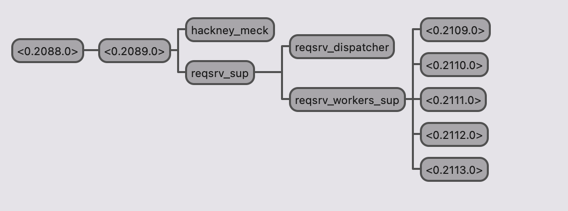

# Sample REST server to handle MSISDN requests

A new server-side application needs to be developed to handle incoming REST requests. Depending on
the request, a defined REST endpoint must be called with MSISDN as the sole request parameter. Upon
receiving the request, the REST endpoint will provide a response consisting of two integer parameters.
The new application should then calculate the sum of these two integers and respond back to the initial
request with the resulting sum.

## Capabilites

+ Parallel MSISDNs requests
+ Processing waits (queued) while a request with the same MSISDN is already in progress
+ Horizontally scalable
+ High availability and network partitioning handling
  + Under majority of nodes the system works normally
  + While on minority of node requests are rejected
+ Reactive process approach (less CPU cycles)

## OTP Design



- One supervisor with a child dispatcher and another supervisor with child workers processes
  - The number of workers is configured in the sys.config file
  - During initialization each worker process notifies the dispatcher (idle worker)
  - The nodes are connected using `net_adm:world()` called at application start
  - `.hosts.erlang` and `sys.config` has to be modified for cluster nodes size 
   
## Call flow
1. Cowboy REST request handler from Client PID
   1. Receives an incoming request with the MSDISDN
   2. If under a minority of nodes in a partitioned network the request is discarded
   3. Tries to acquire a lock for the MSISDN using a global registration and uses a resolve in case of clash
      1. If lock not acquired, the PID owning the MSISDN registration is monitored
      2. Once a DOWN executes step 2
   4. Switches to a Cowboy loop handler
   5. Sends the request to the named dispatcher process (gen_server)
2. The Dispatcher process
   1. A request is received and stored in a LIFO queue
   2. When a worker PID notifies the dispatcher
      1. If the LIFO queue is not empty a request is sent to the worker PID
      2. Otherwise, the worker PID is monitored and stored in a FIFO queue (idle workers). If not already there.
3. A Worker process
   1. Receives a request with the MSISDN and Client Pid
   2. The Client Pid is linked to handle premature client termination
   3. Uses the MSISDN to build the target URL (in sys.config)
   4. Sends a REST client request
   5. The response is sent to the Client PID
6. In the Client PID (at 1)
   1. Matches the response, two integers
   2. Responds to the original request with a JSON object containing the sum of both integers
   3. The client connection is closed
   
NOTE: when using rebar3 test profile the request to the endpoint is mocked

## Command line
```
❯ make

*** ReqSrv Command line ***
NOTES:
- The development environment requires rebar3 and Erlang installed
- The cluster requires Docker and Docker Compose
- The development environment uses the test profile in rebar3 config
- The test profile mocks the request to the REST endpoint

deps                           get deps
compile                        compile
clean                          clean
release                        build release
shell                          start node locally, application boot with console
cluster-up                     cluster up
cluster-down                   cluster down
test                           send some sample requests
```

## Test cases

Start the cluster:
```
❯ make cluster-up
```
wait for `curl --parallel http://localhost:9102/14333` success
NOTE: cluster-up fails, retry.

Test some scenarios:
```
❯ make test
```
To bring node 0 and 1 down, attach and exit:
```
❯ make cluster-attach-0
(reqsrv@req-srv0-core.local)1> ^ CTRL-C

❯ make cluster-attach-1
(reqsrv@req-srv1-core.local)1> ^ CTRL-C
```
Minority of nodes, reject scenario:
```
❯ curl -v http://localhost:9102/14333
*   Trying 127.0.0.1:9102...
* Connected to localhost (127.0.0.1) port 9102 (#0)
> GET /14333 HTTP/1.1
> Host: localhost:9102
> User-Agent: curl/7.87.0
> Accept: */*
>
* Mark bundle as not supporting multiuse
< HTTP/1.1 400 Bad Request
```
Stop the cluster:
```
❯ make cluster down
```

## TODO:
- automate clustering sizing
- control flow
- queue limits
- system metrics
- stress testing and benchmarking 
- global:register_name as a distributed lock mechanism needs more testing
- a lot more ...